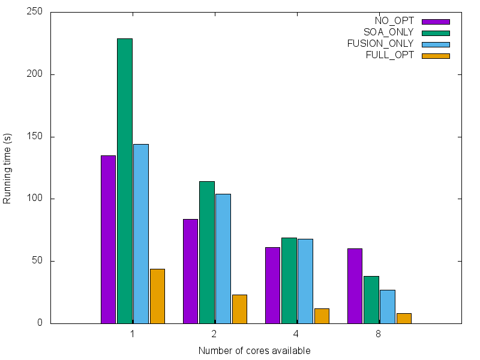
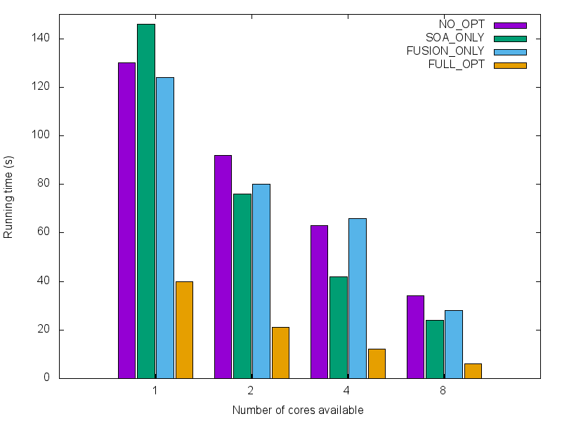

# Evaluation
 
To illustrate the usefulness of the optimizations we presented, we evaluate them on a series of practical examples. In the following section we present benchmark results that show how `SoA` and loop fusion interfere positively.

## Methods
All of our experiments were performed on a server with four `18-core` `Xeon E7-8890 2.50GHz` CPUs and `1007GB` of RAM. We use two apps (TPCHQ1 & TPCHQ6) from the `TPC-H` benchmark[^1eval] suite implemented in Delite. We compile each app four times with one of the following configurations:

- No loop fusion & no `SoA`
- Only `SoA`
- Only loop fusion
- Both loop fusion & `SoA` enabled

All of the other configuration parameters remain unchanged. 
We then run each executable with 1, 2, 4 or 8 cores. 
We use Delite's internal mechanism to measure the execution times. 
Out of five runs per configuration, we keep only the median. 

We report our results below. All of the execution times are given in seconds (lower is better). We also use the configuration with no optimization as a baseline to report the speedups that are achieved in the three other configurations.

## Results

|    `cores` |      `soa` |   `fusion` |     `full` |
| ---------- | ---------- | ---------- | ---------- |
|        `1` |    `0.59x` |    `0.93x` |    `3.05x` |
|        `2` |    `0.73x` |    `0.80x` |    `3.60x` |
|        `4` |    `0.89x` |    `0.91x` |    `4.95x` |
|        `8` |    `1.60x` |    `2.20x` |    `7.46x` |
: Optimization speedups for TPCHQ1

|    `cores` |      `soa` |   `fusion` |     `full` |
| ---------- | ---------- | ---------- | ---------- |
|        `1` |    `0.89x` |    `1.05x` |    `3.22x` |
|        `2` |    `1.21x` |    `1.15x` |    `4.36x` |
|        `4` |    `1.49x` |    `0.95x` |    `5.47x` |
|        `8` |    `1.43x` |    `1.19x` |    `5.21x` |
: Optimization speedups for TPCHQ6

## Discussion
All of the runs where only one of the optimizations is enabled show no significant speedups. In some cases even, the optimization seems to be counter-productive. 

This behavior can be explained in the case of `SoA`. The transformation creates many loops, each one potentially duplicating computation. All of those loops are independent from each other however, and thus, embarrassingly[^2eval] parallelizable. As the parallelism factor increases, `SoA` becomes advantageous. 

The more surprising result is that fusion does not seem to provide a substantial gain, no matter the parallelism factor. The assumption that is made currently in Delite, however, is that fusion is always beneficial and is therefore turned on by default. It might be wise to revisit this assumption and understand precisely when it is productive to enable fusion.

Finally, as expected, we can see that both transformations interfere positively. Even in the rare cases where the other transformations alone are beneficial, the speedups achieved by combining both is higher than their compound effect alone.

[^1eval]: http://www.tpc.org/tpch/default.asp
[^2eval]: https://en.wikipedia.org/wiki/Embarrassingly_parallel